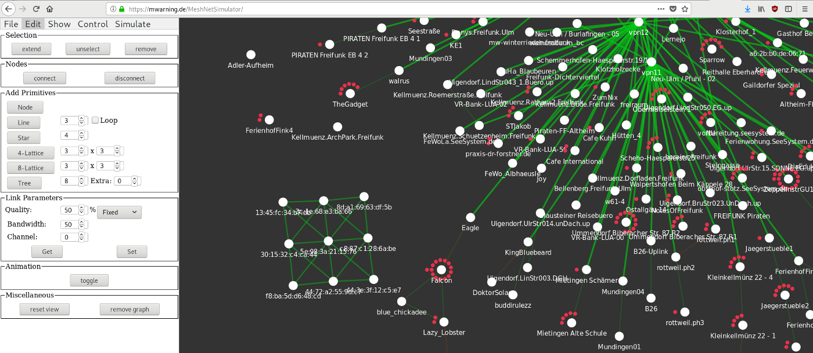

# MeshNetSimulator

Community networks such as [Freifunk](https://freifunk.net) struggle with scaling issues and data overhead beyond a few hundred nodes.

This is a simple simulator for exploring/sketching mesh network routing strategies in the hopes to find better approaches.
The code is written in plain JavaScript/HTML using [d3](https://d3js.org).

Pull requests are welcome!

Features:
- load MeshViewer nodes.json/graph.json data
- create and edit graphs
- run simple simulations

Known issues:
- animation toggle does not work properly
- bandwidth is not handled in simulation
- does not support changing topology and link properties (MANET simulation)

Format Documentation:
- [MeshViewer](https://github.com/ffrgb/meshviewer)
- [NetJSON](http://netjson.org/rfc.html#rfc.section.5) (not supported yet)

For more information about mesh routing see [here](docs/about_mesh_networking.md).

License: GPLv3

## How to Use

### Start

Get the content of the repository and open the file index.html in a browser.

### Create a topology

Either load nodes.json/graph.json (e.g. [nodes](https://regensburg.freifunk.net/data/nodes.json)/[graph](https://regensburg.freifunk.net/data/graph.json)) or create some network using the `Edit` tab.

### Implement a routing strategy (optional)

For sketching a mesh routing strategy, you need to edit the node.js and packet.js files.
Both files can be reloaded using the interface.

### Deploy packets
Deploy packets manually or add defined routes to deploy continuous packets on each simulation step. The number of steps the packets need to arrive at the destination node will be used to calculate an overall efficiency value.

### Simulate

Click the sim button to let the nodes forward the packets to neighbors.
